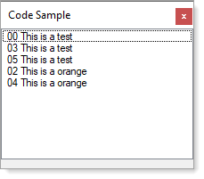

# About



Given an array with duplicates

```csharp
private string[] MockedData()
{
    string[] lines = {
        "This is a test",
        "This is a apple",
        "This is a orange",
        "This is a test",
        "This is a orange",
        "This is a test"
    };

    return lines;
}
```

Get each item and line number

**See also** 

ArraryCode.GetAllDuplicates()