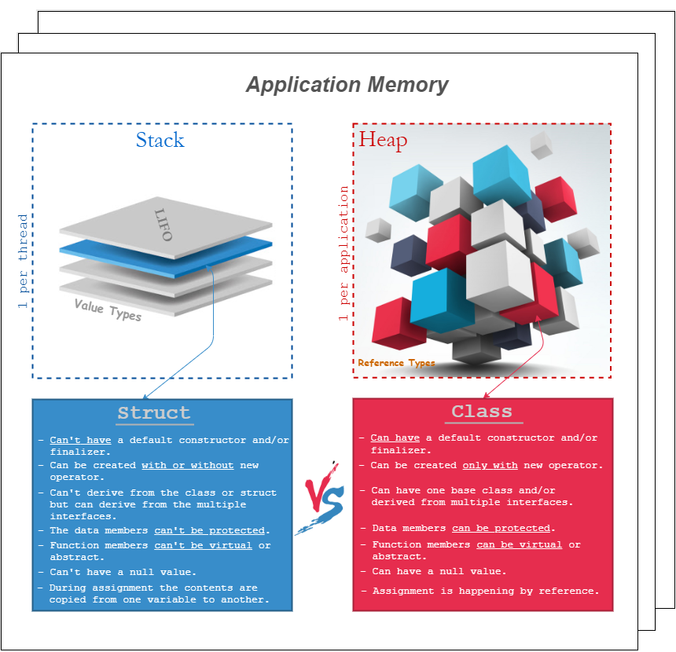

# About

In .NET, there are two categories of types, `reference types` and `value types`.

`Structs` are `value types` and `classes` are `reference types`.

The general difference is that a reference type lives on the heap, and a value type lives inline, that is, wherever it is your variable or field is defined.

A variable containing a value type contains the entire value type value. For a struct, that means that the variable contains the entire struct, with all its fields.

A variable containing a reference type contains a pointer, or a reference to somewhere else in memory where the actual value resides.

This has one benefit, to begin with:

- `value types` always contains a value
- `reference types` can contain a null-reference, meaning that they don't refer to anything at all at the moment

Internally, reference types are implemented as pointers, and knowing that, and knowing how variable assignment works, there are other behavioral patterns:

- Copying the contents of a value type variable into another variable, copies the entire contents into the new variable, making the two distinct. In other words, after the copy, changes to one won't affect the other
- Copying the contents of a reference type variable into another variable, copies the reference, which means you now have two references to the same somewhere else storage of the actual data. In other words, after the copy, changing the data in one reference will appear to affect the other as well, but only because you're really just looking at the same data both places

## Difference between Structs and Classes:

