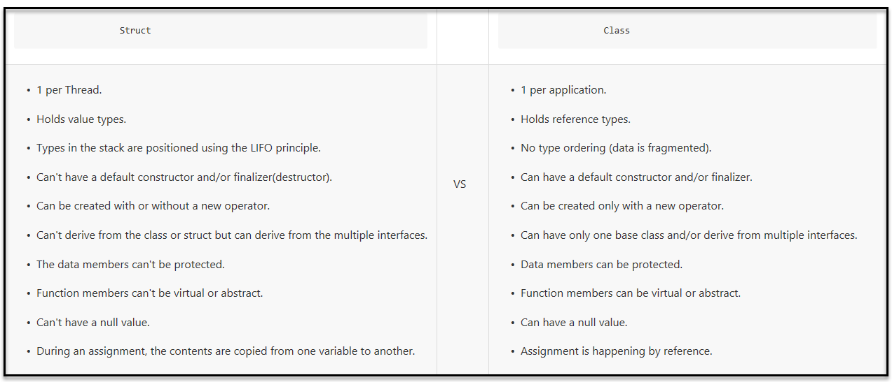
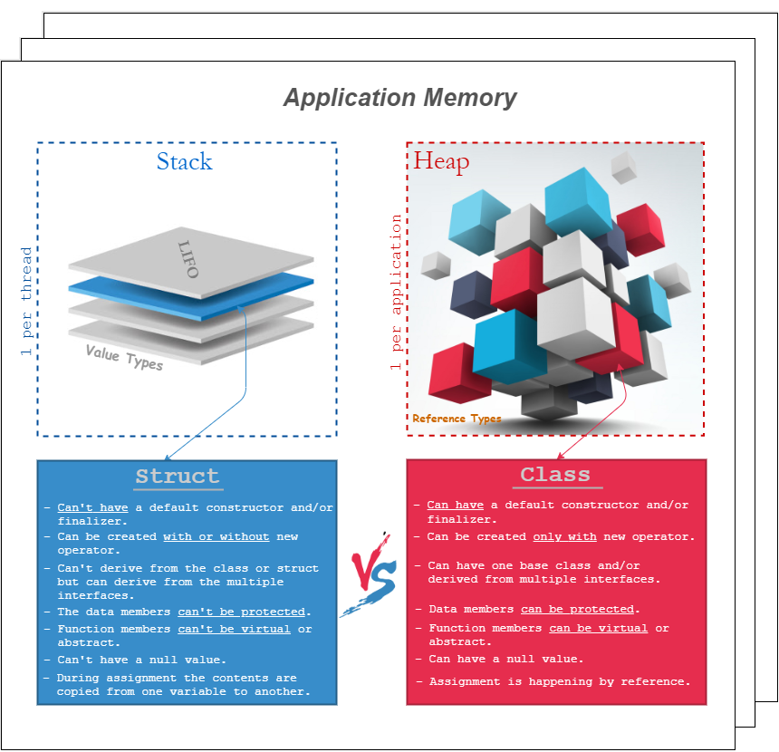

# About

For teaching about [commonly used collection types](https://docs.microsoft.com/en-us/dotnet/standard/collections/commonly-used-collection-types)

New developers to C# with little to no formal training when needing a collection/container will scour the web for a suitable collection and inevitably find `List<T>` or `Array`.

Dependent on the task, what comes next is

- The container fits the task
- The container fits the task but is slow performance-wise
- After review, the container does not fulfill the task completely
  - Container allows modications to data that should not be modified, meaning an `immutable` vs `mutable`
  - Allows duplicates where no duplicates are permitted.
  - Does not work well with other sections of the application e.g. a report requires a `List<T>` and the choice was a `DataTable`

Looking at using a [DataTable](https://docs.microsoft.com/en-us/dotnet/api/system.data.datatable?view=net-6.0) when a [List](https://docs.microsoft.com/en-us/dotnet/api/system.collections.generic.list-1?view=net-6.0)&lt;T> is needed the average developer hops back on the web and finds a language extension (**Figure 1**) that converts a `DataTable` to a `List`. This solves one problem but may lead to other issues such as time to perform the conversion when response time is critical.

**Note:** Although DataTable is old they still have a place in today's world. See [the following](https://github.com/karenpayneoregon/DataTablesOperationsEvents) for their events and change notification.

In the Visual Studio solution there is an exploration of common collections/containers with advantages and gochas.

This will be followed up with `design patterns`.


**Figure 1**

```csharp
public static List<TSource> DataTableToList<TSource>(this DataTable table) where TSource : new()
{
    List<TSource> list = new();

    var typeProperties = typeof(TSource).GetProperties().Select(propertyInfo => new
    {
        PropertyInfo = propertyInfo,
        Type = Nullable.GetUnderlyingType(propertyInfo.PropertyType) ?? propertyInfo.PropertyType
    }).ToList();

    foreach (var row in table.Rows.Cast<DataRow>())
    {

        TSource current = new();

        foreach (var typeProperty in typeProperties)
        {
            object value = row[typeProperty.PropertyInfo.Name];
            object safeValue = value is null || DBNull.Value.Equals(value) ? null : Convert.ChangeType(value, typeProperty.Type);
            typeProperty.PropertyInfo.SetValue(current, safeValue, null);
        }

        list.Add(current);
    }

    return list;
}
```

This can be avoided by knowing both business requirements along with communication between components in various task.


## Immutable collections .NET Core (C# 9)

In software development, an `immutable object` is one that once created, can't change. 

Provides methods for creating an class instance that is immutable; meaning it cannot be changed once it is created.

In this solution see th [following project](https://github.com/karenpayneoregon/containers-csharp/tree/master/ConsoleApp1) where code is based off Mobile friendly weekly claims application.cfc component..

**Mutable design note getters/setters**

```csharp
class OrderLine
{
    public int Quantity { get; set; }
    public decimal UnitPrice { get; set; }
    public float Discount { get; set; }

    public decimal Total
    {
        get
        {
            return Quantity * UnitPrice * (decimal) (1.0f - Discount);
        }
    }
}
class Order 
{     
    public Order()
    {
         Lines = new List<OrderLine>();
    } 

    public List<OrderLine> Lines { get; } 
}
```

**Immutable design**

```csharp
class OrderLine
{
    public OrderLine(int quantity, decimal unitPrice, float discount)
    {
        Quantity = quantity;
        UnitPrice = unitPrice;
        Discount = discount;
    }

    public int Quantity { get; }

    public decimal UnitPrice { get; }

    public float Discount { get; }

    public decimal Total
    {
        get
        {
            return Quantity * UnitPrice * (decimal) (1.0f - Discount);
        }
    }
}
```

This new design requires that you create a new instance of an `OrderLine` whenever any of the values changes. You can make the design a bit more convenient by adding `WithXxx` methods that let you update individual properties without having to explicitly call the constructor yourself:

```csharp
class OrderLine
{
    // ...

    public OrderLine WithQuantity(int value)
    {
        return value == Quantity
                ? this
                : new OrderLine(value, UnitPrice, Discount);
    }

    public OrderLine WithUnitPrice(decimal value)
    {
        return value == UnitPrice
                ? this
                : new OrderLine(Quantity, value, Discount);
    }

    public OrderLine WithDiscount(float value)
    {
        return value == Discount
                ? this
                : new OrderLine(Quantity, UnitPrice, value);
    }
}

```

**Usage**

```csharp
OrderLine apple = new OrderLine(quantity: 1, unitPrice: 2.5m, discount: 0.0f);
OrderLine discountedAppled = apple.WithDiscount(.3f);
```

**From Code magazine** 

The author has created a custom exception class which is [ImmutableHashSet](https://docs.microsoft.com/en-us/dotnet/api/system.collections.immutable.immutablehashset-1?view=net-6.0). Note HashSet are unordered as in this case we careless about ordering. Implementation provides custom exception message when attempting to change properties in a class instance.

```csharp

public class InvalidDataTypeException : Exception
{
        public static ImmutableHashSet<string>
    ValidImmutableClassTypes =
        ImmutableHashSet.Create<string>(
        "Boolean",
        "Byte",
        "SByte",
        "Char",
        "Decimal",
        "Double",
        "Single",
        "Int32",
        "UInt32",
        "Int64",
        "UInt64",
        "Int16",
        "UInt16",
        "String",
        "ImmutableArray",
        "ImmutableDictionary",
        "ImmutableList",
        "ImmutableHashSet",
        "ImmutableSortedDictionary",
        "ImmutableSortedSet",
        "ImmutableStack",
        "ImmutableQueue"
    );

    public InvalidDataTypeException(
        ImmutableHashSet<string> invalidProperties) : base(
        $"Properties of an instance of " +
        "ImmutableClass may only " +
        "contain the following types: Boolean, Byte, " +
        "SByte, Char, Decimal, Double, Single, " +
        "Int32, UInt32, Int64, " +
        "UInt64, Int16, UInt16, String, ImmutableArray, " +
        "ImmutableDictionary, ImmutableList, ImmutableQueue, " +
        "ImmutableSortedSet, ImmutableStack or ImmutableClass. " +

        $"Invalid property types: " +
        $" {string.Join(",", invalidProperties.ToArray())}")
    {
        Data.Add("InvalidPropertyTypes",
            invalidProperties.ToArray());
    }
}

```

# init keyword C# 9

**Init only setters** provide consistent syntax to initialize members of an object. Property initializers make it clear which value is setting which property. The downside is that those properties must be settable. Starting with C# 9.0, you can create init accessors instead of set accessors for properties and indexers. Callers can use property initializer syntax to set these values in creation expressions, but those properties are readonly once construction has completed. Init only setters provide a window to change state. That window closes when the construction phase ends. The construction phase effectively ends after all initialization, including property initializers and with-expressions have completed.

**Common classes**

- [ImmutableList](https://docs.microsoft.com/en-us/dotnet/api/system.collections.immutable.immutablelist-1?redirectedfrom=MSDN&view=net-6.0)&lt;T> Class
- [ImmutableDictionary](https://docs.microsoft.com/en-us/dotnet/api/system.collections.immutable.immutabledictionary-2?redirectedfrom=MSDN&view=net-6.0)<TKey,TValue>
- [ImmutableHashSet](https://docs.microsoft.com/en-us/dotnet/api/system.collections.immutable.immutablehashset-1?redirectedfrom=MSDN&view=net-6.0)&lt;T>


## init-only setter
The main differences and similarities are described in this table:


|                      | Constructor parameter | `init` property |
|----------------------|-----------------------|-----------------|
|Since                 | C# 1.0                | [C# 9.0][1]     |
|Are required / Has hard guarantees about being present | Yes                   | No              |
|Self-documenting      | [Since C# 4.0][2]     | Yes             |
|Can overwrite `readonly` fields| Yes | Yes |
|Suitable for          | Required and optional values       | Optional values |
|Ease of reflection    | Just use `ConstructorInfo`     | Horrible |
|Supported by [MEDI][3]| Yes                   | No              |
|[Breaks `IDisposable`][4]| No                    | Yes             |
|Class knows init order| Yes                   | No              |
|Ergonomics when subclassing| Tedious|Decent|

The downsides of `init` are mostly inherited from the downsides of C#'s object-initializer expressions which still have numerous issues (in the footnote).

As for when you should vs. shouldn't:

* Don't use `init` properties for required values - use a constructor parameter instead.
* _Do_ use `init` properties for nonessential, non-required, or otherwise optional values that when set via individual properties do not invalidate the object's state.

------

* In short, `init` properties make it _slightly easier_ to initialize nonessential properties in immutable types - however they also make it easier to shoot yourself in the foot if you're using `init` for _required_ members instead of using a constructor parameter, _especially_ C# 8.0 nullable-reference-types (as there's no guarantees that a non-nullable reference-type property will ever be assigned).
* In terms of guidance:
  * If your `class` is not immutable, or at least does not employ immutable-semantics on certain properties then you don't need to use `init` on those properties.
  * If it's a `struct` then don't use `init` properties at all, due to all the small details in `struct` copy behavior.
  * In my opinion (not shared by everyone else), I recommend you consider an optional (could also be nullable) constructor parameter or an entire different constructor overload instead of `init` properties given the problems I feel they have and lack of any real advantages.

------

Footnote: Problems with C# object-initializer syntax, inherited by `init` properties:

* [Breaks debugging][5]: Even in C# 9, if any line of the initializer throws an exception then the exception's `StackTrace` will be the same line as the `new` statement instead of the line of the sub-expression that caused the exception.
* [Breaks `IDisposable`][4]: if a property-setter (or initialization expression) throws an exception and _if_ the type implements `IDisposable` then the newly created instance will not be disposed-of, even though the constructor completed (and the object is fully initialized as far as the CLR is concerned).


  [1]: https://docs.microsoft.com/en-us/dotnet/csharp/language-reference/keywords/init
  [2]: https://docs.microsoft.com/en-us/dotnet/csharp/programming-guide/classes-and-structs/named-and-optional-arguments
  [3]: https://docs.microsoft.com/en-us/dotnet/api/microsoft.extensions.dependencyinjection?view=dotnet-plat-ext-6.0
  [4]: https://stackoverflow.com/questions/6409918/object-initializer-and-dispose-when-property-can-throw-exception
  [5]: https://stackoverflow.com/questions/40768906/cannot-identify-the-property-which-throw-exception-when-using-object-initializer

## Struct

In .NET, there are two categories of types, `reference types` and `value types`.

`Structs` are `value types` and `classes` are `reference types`.

The general difference is that a reference type lives on the heap, and a value type lives inline, that is, wherever it is your variable or field is defined.

A variable containing a value type contains the entire value type value. For a struct, that means that the variable contains the entire struct, with all its fields.

A variable containing a reference type contains a pointer, or a reference to somewhere else in memory where the actual value resides.

This has one benefit, to begin with:

- `value types` always contains a value
- `reference types` can contain a null-reference, meaning that they don't refer to anything at all at the moment


Internally, reference types are implemented as pointers, and knowing that, and knowing how variable assignment works, there are other behavioral patterns:


- Copying the contents of a value type variable into another variable, copies the entire contents into the new variable, making the two distinct. In other words, after the copy, changes to one won't affect the other
- Copying the contents of a reference type variable into another variable, copies the reference, which means you now have two references to the same somewhere else storage of the actual data. In other words, after the copy, changing the data in one reference will appear to affect the other as well, but only because you're really just looking at the same data both places

## Difference between Structs and Classes:





## Anonymous Types

Anonymous types provide a convenient way to encapsulate a set of read-only properties into a single object without having to explicitly define a type first. The type name is generated by the compiler and is not available at the source code level. The type of each property is inferred by the compiler.

You create anonymous types by using the new operator together with an object initializer. 

### Example

```csharp
var contacts = new[]
{
    new
    {
        Name = "Eugene Jones",
        PhoneNumbers = new[] { "206-555-0108", "425-555-0001" }
    },
    new
    {
        Name = "Mary Smith",
        PhoneNumbers = new[] { "650-555-0199" }
    }
};

foreach (var contact in contacts)
{
    Debug.WriteLine($"{contact.Name}");
    foreach (var phoneNumber in contact.PhoneNumbers)
    {
        Debug.WriteLine($"\t{phoneNumber}");
    }
}
```

While for a broad scope

```csharp
SingleContact[] contacts =
{
    new()
    {
        Name = "Eugene Jones",
        PhoneNumbers = new[] { "206-555-0108", "425-555-0001" }
    },
    new()
    {
        Name = "Mary Smith",
        PhoneNumbers = new[] { "650-555-0199" }
    }
};

foreach (var contact in contacts)
{
    Debug.WriteLine($"{contact.Name}");
    foreach (var phoneNumber in contact.PhoneNumbers)
    {
        Debug.WriteLine($"\t{phoneNumber}");
    }
}
```


## Pluralsight courses

[Advanced C# Collections](https://app.pluralsight.com/library/courses/csharp-collections-advanced/table-of-contents) (four hours)


